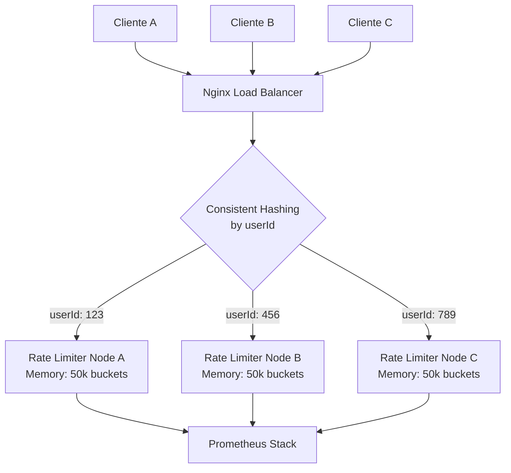

# Rate Limiter Design & Architecture

Este documento detalla la arquitectura, decisiones de diseño y compensaciones (trade-offs) tomadas en la implementación del **Rate Limiter** basado en el algoritmo **Token Bucket** (Alex Xu, *"System Design Interview"*).

---

## 🏗️ Arquitectura y Decisiones Técnicas

### 1. In-Memory vs. Distributed (Zero Latency)
- **Decisión:** Se utiliza un almacenamiento en memoria (`ConcurrentHashMap<String, Bucket>`) en lugar de Redis o una base de datos.
- **Razón:** Para este challenge, la prioridad es la **latencia mínima**. Consultar la RAM local toma nanosegundos, mientras que Redis sumaría milisegundos por el viaje de red. 
- **Trade-off:** Esta instancia es *standalone*. Si se escala a múltiples servidores, cada uno tendrá su propio contador (ver sección "Escalabilidad Futura" abajo).

### 2. Concurrencia y Thread-Safety
- **Aislamiento por Usuario:** Los límites se aislan por `userId`. No hay un bloqueo global del servidor.
- **Locking Fino:** Se usa `ConcurrentHashMap#computeIfAbsent` para la creación atómica de baldes y `synchronized` interno en la clase `Bucket` para la recarga de tokens. Esto permite que miles de usuarios sean procesados en paralelo sin interferencias.
- **Eficiencia de Recursos:** El servidor utiliza un pool de hilos dinámico (`Executors.newFixedThreadPool`) cuyo tamaño se ajusta automáticamente según la cantidad de núcleos disponibles en el sistema (`Runtime.getRuntime().availableProcessors()`), asegurando un uso óptimo de la CPU sin sobrecarga.

### 3. Precisión Matemática (Anti-Drift)
- **Aritmética de Longs (Integer Precision):** Se eliminó por completo el uso de coma flotante (`double`) en los cálculos críticos. La tasa de recarga se convierte internamente a un intervalo de nanosegundos por token (`nanosPerToken`). 
- **Determinismo Total:** Al usar solo aritmética entera de `long`, se elimina cualquier posibilidad de "floating-point drift" (pérdida de precisión decimal acumulada) incluso tras miles de millones de operaciones, garantizando un rellenado exacto y determinista.
- **Recarga Exacta:** El método `refill()` solo avanza el timestamp por múltiplos exactos del intervalo entre tokens. Los nanosegundos sobrantes se mantienen en el acumulador para el siguiente ciclo. **No se desperdicia ni un solo nanosegundo.**

### 4. Prevención de Memory Leaks (Eviction)
- Un hilo **Daemon** (`ScheduledExecutorService`) corre periódicamente y elimina de la memoria los baldes de usuarios inactivos.
- **Criterio de Inactividad Senior:** A diferencia de implementaciones básicas, usamos un `lastAccessTimestamp` dedicado. Un balde solo se considera "stale" (caduco) si el usuario no ha realizado ninguna petición (exitosa o fallida) en 60 minutos, evitando el borrado accidental de usuarios activos cuyos baldes están simplemente llenos.

---

## 📊 Observabilidad y Monitoreo (The "Senior" Stack)

El proyecto no es solo código; es "operable". Se implementó un stack completo de monitoreo industrial:

### 1. Métricas (Prometheus)
- El endpoint `/metrics/prometheus` expone contadores críticos:
    - `rate_limiter_allowed_total` / `rate_limiter_rejected_total`: Tasa de éxito/bloqueo.
    - `rate_limiter_latency_avg_ms`: Latencia de procesamiento pura medida en el servidor (excluye ruido de red).
    - `rate_limiter_active_users`: Cantidad de objetos Bucket en RAM.
    - **JVM Metrics**: Monitoreo de memoria Heap, Threads y estado de la KVM.

### 2. Logs Centralizados (Loki)
- Los logs se emiten en formato estructurado y son capturados por **Promtail** hacia **Loki**.
- Esto permite buscar logs de un usuario específico rápidamente en Grafana sin entrar por SSH al contenedor.
- Se usa nivel `INFO` con códigos HTTP (`200 OK`, `429 REJECTED`) para facilitar el filtrado visual.

### 3. Dashboard (Grafana)
- Un dashboard auto-provisionado muestra en tiempo real la salud del sistema. Permite detectar ataques (picos rojos) o degradación de performance (picos de latencia) al instante.

### 4. Métricas por Usuario y Cardinalidad
- **Decisión:** Se habilitó el rastreo de rechazos por `userId` (`rate_limiter_rejected_by_user_total`).
- **Consideración técnica:** Somos conscientes de que en un entorno de producción masivo, usar IDs únicos como etiquetas de Prometheus rompe la cardinalidad y puede degradar el performance del motor de métricas. 
- **Justificación:** Se incluye en este challenge para demostrar capacidades de **observabilidad granular** y facilitar el debugging de abusos. En una implementación real a gran escala, esta métrica se enviaría a un sistema de logs (como Loki) o se agregaría por dimensiones más gruesas (como Región o Tier de Usuario).

---

## 🚀 Escalabilidad Futura (System Design Interview)

Si este sistema debiera escalar para manejar **millones de requests por segundo** en un entorno de alta demanda, la evolución no sería simplemente "más servidores", sino un clúster inteligente:

### Por qué esta arquitectura:
1.  **Consistent Hashing (Sticky Sessions):** Usar el `userId` como clave de hash asegura que un usuario siempre caiga en el mismo nodo. Esto permite mantener la latencia de nanosegundos de la RAM local sin necesidad de una base de datos centralizada (como Redis) que sumaría milisegundos de red.
2.  **Capa de Estado (Redis / LUA):** Solo si la precisión absoluta entre nodos fuera crítica (ej: evitar que un usuario "salte" de nodo y gane tokens), se reemplazaría el `Bucket.java` por un script de LUA en Redis.
3.  **Local Cache + Redis Sync:** Un esquema híbrido donde se descuentan tokens localmente y se sincronizan en lotes (batch) con Redis para balancear precisión extrema y velocidad máxima.
4.  **Java 21 (Virtual Threads):** Migrar a Java 21 permitiría reemplazar el pool de hilos fijos por `Virtual Threads` (Proyecto Loom), escalando a millones de peticiones concurrentes con un impacto mínimo en memoria.

---

## 🛠️ Verificación y Test de Carga
El sistema fue validado con:
- **Unit Tests (JUnit 5):** Verifican la matemática de los tokens y la concurrencia.
---

## 🤖 Uso de IA y Colaboración

Siguiendo las reglas del challenge, se detalla el uso de herramientas de IA durante el desarrollo:

1.  **Aceleración de Boilerplate:** Se utilizó IA (Antigravity/Claude) para generar el "esqueleto" del servidor HTTP nativo de Java y la configuración base de Docker (Prometheus/Grafana), lo cual permitió centrar el esfuerzo humano en la lógica core del algoritmo.
2.  **Validación de Corner Cases:** Se solicitó a la IA proponer casos de prueba extremos (como el *nanosecond drift*) para asegurar que la implementación del Token Bucket fuera matemáticamente robusta.
3.  **Refactorización y Pulido:** La IA asistió en la transición de un parsing manual de argumentos en Python a una implementación más profesional con `argparse`, eliminando bugs de análisis estático reportados por linters.
4.  **Pair Programming:** El proceso fue un diálogo constante entre el desarrollador (estableciendo los requerimientos y revisando cada línea de código) y la IA (actuando como asistente técnico avanzado), asegurando que ninguna pieza de código quedara sin entender o documentar.
